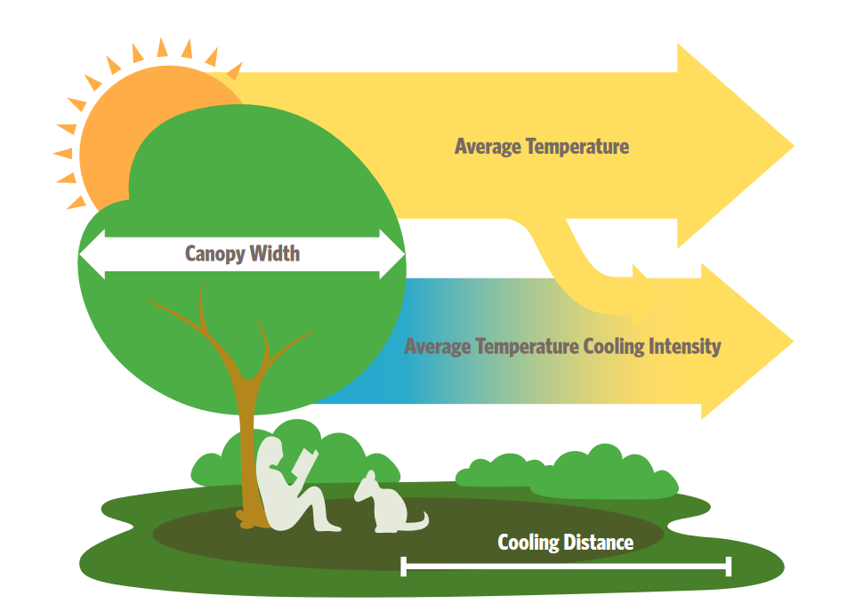
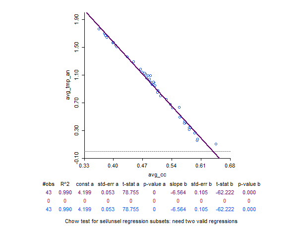

# SISTEMA PARA APROVAÇÃO DE PROJETOS URBANOS EM CANELA
#### v0.1
## Introdução
Sob o contexto de uma suposta ausência de critério para compensação ambiental em ambientes urbanos, a proposta do trabalho a seguir é descrever a metodologia do desenvolvimento de um sistema para aprovação de projetos na cidade de Canela. O presente artigo busca apresentar a situação atual do trabalho corrente, servindo como recurso para consulta e atualização durante a construção do sistema.

## Materiais e métodos
### Indicadores Ambientais
#### Heat Mitigation Index e Cooling Capacity Index 
O Heat Mitigation Index (HMI) do modelo InVEST (Integrated Valuation of Ecosystem Services and Tradeoffs) é uma ferramenta que avalia a capacidade das áreas verdes e do solo em mitigar o calor urbano. Esse índice é útil para o planejamento urbano sustentável, ao identificar áreas de maior necessidade de vegetação para redução de ilhas de calor. 
O indicador do HMI é um valor entre 0 a 1, estando os valores positivos atrelados a magnitude do impacto em cada pixel relativo às massas vegetadas próximas, e negativos o quanto mais distantes dessas massas vegetadas.
Os parâmetros para execução do modelo dependem de 4 dados de entrada, sendo o mapa de uso do solo em formato TIF, evapotranspiração (TIF), área de interesse (SHP) e tabela biofísica (CSV), onde serão determinados os pesos de cada classe de uso do solo para cada condicional, sendo elas:
* **lucode**: *int* – Código da classe de uso do solo
* **kc**: *float* – Coeficiente de colheita (razão de evapotranspiração para o tipo de vegetação)
* **green_area**: *int* – Valor booleano de identificação se classe é **vegetação** (1) ou **não-vegetação** (0)
* **shade**: *float* – Proporção de área da classe coberta por dossel de árvores de pelo menos 2 metros de altura
* **albedo**: *float* – Proporção de radiação solar refletida pela superfície da classe de uso do solo
* **building_intensity**: *float* – Razão de área construída pela área total

Essas condicionais devem ser avaliados de acordo com cada classe de uso do solo. A classificação do uso do solo deve especificar suas classes considerando essas condicionais como fator de impacto. Agregado à esses dados de entrada, complementa-se ao modelo dados de referência das condições meteorológicas da área de estudo, sendo elas:
* **Reference Air Temperature** (ºC) - Temperatura média  de referência em área rural, onde o efeito de ilha de calor urbana não é observado
* **UHI Effect** (ºC) - Urban Heat Island. Diferença entre  temperatura média de áreas rurais e temperatura máxima observada em áreas urbanas.
* **Air Blending Distance** (m) - Raio sobre o qual se calcula a média das temperaturas do ar para contabilizar a mistura do ar.
* **Maximum Cooling Distance** (m) - Distância sobre quais áreas verdes maiores que 2 ha possuem efeito de resfriamento
* **Cooling Capacity Method** (booleano) - Método de predição da temperatura do ar. Daytime x Nighttime

O Heat Mitigation Index (HMI) e o Cooling Capacity Index (CCI) são conceitos usados em análises ambientais para avaliar a capacidade de uma área em mitigar o calor e, embora relacionados, possuem enfoques diferentes. Ambos podem ser utilizados em modelos como o InVEST (Integrated Valuation of Ecosystem Services and Tradeoffs), mas desempenham papéis distintos no contexto de mitigação de ilhas de calor. Vamos explorar as diferenças entre eles:
1. Cooling Capacity Index (CCI)

    1.1. Definição: O Cooling Capacity Index (CCI) mede a capacidade inerente de uma área (geralmente coberturas vegetais) em reduzir ou mitigar o aumento da temperatura ambiente. 
    O CCI está relacionado a características físicas de uso do solo que contribuem para o resfriamento, como áreas verdes, parques, florestas urbanas, superfícies de água, etc

    
 CCi = 0.6 . shade + 0.2 .albedo + 0.2 . ETI 

    1.2. Objetivo: Avaliar a potencialidade natural de uma área para reduzir o calor, sem levar em consideração necessariamente o efeito real na temperatura

    1.3. Fatores influenciadores:
        Cobertura de vegetação (principalmente árvores e gramados).
        Presença de superfícies de água (lagos, rios, áreas úmidas).
        Tipo de solo (solo permeável vs. pavimentado)

    1.4. Aplicação: O CCI é útil para identificar áreas com alto potencial de resfriamento natural e pode ser usado para guiar decisões sobre onde manter ou melhorar infraestrutura verde em áreas urbanas.
    

O gráfico apresenta a dispersão (scatter plot) com uma regressão linear entre duas variáveis:

Eixo X: Representa o Average Cooling Capacity (avg_cc).

Eixo Y: Representa o Average Temperature Increase (avg_tmp_an).

Principais informações do gráfico:

R² (Coeficiente de Determinação): O valor de 0.990 indica que o modelo de regressão linear ajusta-se muito bem aos dados. Isso significa que 99% da variação na variável dependente (aumento médio de temperatura) pode ser explicada pela variável independente (capacidade de resfriamento médio). Em outras palavras, há uma forte correlação entre essas duas variáveis.

Coeficiente angular (slope b): O valor do coeficiente angular é -6.564, indicando que para cada aumento unitário em avg_cc, o aumento médio da temperatura (avg_tmp_an) diminui em aproximadamente 6.564 unidades. Isso reforça a ideia de que há uma correlação negativa entre as duas variáveis: à medida que a capacidade de resfriamento aumenta, o aumento médio da temperatura diminui.

Significância dos coeficientes (P-value): Os valores de P-value (0.000) indicam que tanto a constante quanto o coeficiente angular são estatisticamente significativos, ou seja, existe uma relação real entre avg_cc e avg_tmp_an.

Interpretação geral:

Há uma relação inversamente proporcional forte entre a Cooling Capacity e o aumento de temperatura. Áreas com maior capacitação de resfriamento estão associadas a um menor aumento de temperatura, o que é esperado em termos de mitigação de ilhas de calor.
O gráfico também sugere que o modelo linear é uma boa representação dessa relação, dado o alto valor de R² e a linearidade clara entre as duas variáveis.

2. Heat Mitigation Index (HMI)

    2.1. Definição: O Heat Mitigation Index (HMI), por outro lado, é uma medida que considera tanto a capacidade de resfriamento de uma área quanto o seu impacto real na redução da temperatura. Ou seja, o HMI considera como a presença de áreas com alto CCI impacta efetivamente as temperaturas locais, levando em conta não apenas a capacidade inerente de resfriamento, mas também o efeito de mitigação que já está ocorrendo

    2.2. Objetivo: Avaliar o efeito real de mitigação de calor que uma área ou cobertura vegetal está proporcionando para o ambiente circundante, além do potencial teórico

    2.3 Fatores influenciadores:
        Fatores similares ao CCI (cobertura verde, superfícies de água, etc.).
        Consideração dos efeitos locais de microclima e aumento de temperatura real na área

    2.4. Aplicação: O HMI é mais específico para análises de impacto atual de políticas e práticas urbanas sobre o calor, sendo utilizado para monitorar áreas onde o resfriamento já está acontecendo ou onde é necessário melhorar a mitigação.

Diferenças Principais:

* Foco:
    CCI foca no potencial de resfriamento natural de uma área, baseado em suas características de uso do solo.
    HMI foca no efeito real de mitigação de calor, considerando o impacto atual das características da área na redução da temperatura.

* Aplicação:
    CCI é mais usado em planejamento e avaliação de potencial de resfriamento, sendo uma métrica preditiva sobre o que poderia acontecer se determinada área verde fosse mantida ou aumentada.
    HMI é uma métrica de monitoramento e análise do efeito que a área já está causando em termos de redução do calor. Pode ser usado para avaliar a eficiência das estratégias de mitigação já implementadas.

* Escopo:
    O CCI é frequentemente mais utilizado em avaliações ecossistêmicas e na infraestrutura verde urbana, enquanto o HMI pode ser usado em análises mais abrangentes de impacto climático em áreas urbanas.

Resumo:

* **CCI**: Mede o potencial de resfriamento de uma área baseado em suas características.
* **HMI**: Avalia o impacto real de mitigação de calor e o efeito que áreas com alto CCI estão gerando no ambiente em termos de temperatura.

Esses dois índices, quando combinados, são poderosos para embasar políticas urbanas que busquem reduzir o efeito das ilhas de calor em áreas metropolitanas, orientando decisões sobre preservação e criação de infraestruturas verdes. O modelo InVEST, especificamente, utiliza esses conceitos para ajudar a quantificar os serviços ecossistêmicos prestados por diferentes tipos de uso do solo em contextos de planejamento urbano.

#### NDVI
#### Classificação não-supervisionada de Uso do Solo
Visto os problemas de classificação generalizada do MapBiomas, optou-se pela classificação do uso e superfície do solo a partir da Ortofoto disponível na plataforma [SIGWEB](https://canela.ctmgeo.com.br) de Canela.

O método de classificação utilizado foi o algoritmo de agrupamento K-means para classificação não supervisionada das classes de uso do solo, afim de criar um primeiro esboço de classes gerais para o ambiente urbano.

Como recurso para classificação, foi utilizado o vetor de polígonos dos edifícios como máscara durante o processo, podendo assim evitar maiores erros durante, como intervenção de sombras sobre o teto de edificações, podendo confundir com classes do tipo vegetal. 

Visto a escala dos pixels da ortofoto (0.08m), foi necessário reduzir a qualidade para pelo menos 1m, para tornar possível a execução do K-means para a ortofoto toda de uma vez, visto que a segmentação da imagem, classificando uma por uma provocava desconexão entre as classes de uma imagem para outra.

#### Fluxograma do processo
##### Simulação de HMI a partir de propostas

##### Definição de classes e atributos

#### Resultados obtidos

#### Problemas observados e limitações

#### Aprimoramentos previstos